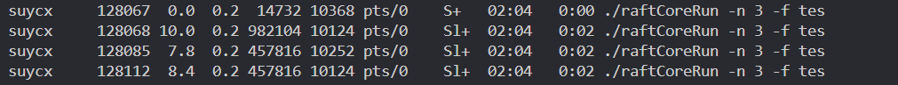

# sylarbased分支

[集成rpc服务的sylar框架仓库及说明](https://github.com/SuycxZMZ/sylar-from-suycx)

## [原KVstorageBaseRaft-cpp项目简介](docs/README.md)

## [main分支](https://github.com/SuycxZMZ/KVstorageBaseRaft-cpp/tree/main)

## 改进

- raft核心代码注释补全，[主干详细代码执行流说明](docs/项目解析.md)
- 使用集成rpc服务的sylar网络框架重构
- [main分支](https://github.com/SuycxZMZ/KVstorageBaseRaft-cpp/tree/main)重写muduo网络库，主要组件均已实现，支持更简单好用的异步日志系统。[日志系统可以单独剥离](https://github.com/SuycxZMZ/symlog)。
- [rpc详细解析](https://github.com/SuycxZMZ/MpRPC-Cpp)
- AE和投票信息的的发送使用线程池处理，避免频繁创建销毁大量线程。
- 移除fiber文件夹，直接使用sylar协程调度器调度(使用时要仔细考虑好调度器的线程数，既要处理网络收发，又要处理两个定时任务)
- 对raft层的rpc调用方进行加锁保护，使每次调用的发送和接收为一个原子过程，避免出现答非所问和多线程写同一个socket
- 对raft层的每个rpc调用设置超时时间，避免长时间阻塞造成后续调用不能及时执行，确保每个调用的时效性
- 优化代码组织结构，移除多余的include文件夹，更清爽的cmake代码结构，减少重复编译和路径污染

## 使用

1.库准备

- 安装带rpc服务的sylar网络库，[sylar-from-suycx](https://github.com/SuycxZMZ/sylar-from-suycx)
- `boost`
- `protoc`
- 注意：我在[sylar-from-suycx](https://github.com/SuycxZMZ/sylar-from-suycx)项目的tools-packages文件夹下放了zookeeper3.4.1的安装包，如果是arm架构的cpu要装这个，官方原版的包有个函数里面直接用了x86的汇编，没加条件编译，会直接报错

2.安装说明

- protoc，本地版本为3.12.4，ubuntu22使用`sudo apt-get install protobuf-compiler libprotobuf-dev`默认安装的版本在这个附近，大概率能用，项目的tools-package中也放了3.12.4的源码，编译安装就行，如果报错直接百度，很好解决。ubuntu24.04默认安装的是3.21.1，编译会报错，目前没有解决。
- boost，`sudo apt-get install libboost-dev libboost-test-dev libboost-all-dev`，raft核心代码中使用boost进行日志序列化生成快照。

3.编译

```shell
# 安装 sylar
https://github.com/SuycxZMZ/sylar-from-suycx

# 注意，在编译KVRaft项目之前，最好执行一下根目录下的`configureproto.sh`脚本，这个脚本会自动生成proto文件对应的.pb.h和.pb.cc文件，覆盖原本的文件
sudo bash configureproto.sh

# KVRaft本项目编译运行
mkdir cmake-build-debug
cd cmake-build-debug
cmake ..
make -j4
```

之后在目录bin就有对应的可执行文件生成：

- `callerMain`(consumer)
- `raftCoreRun`(provider)
  
注意先运行provider，再运行consumer
运行时在bin目录下提供了一个`test.config`配置文件，按照两个可执行文件打印的 help 信息进行加载，启动raft集群和测试客户端代码

## 节点故障情况模拟

```shell
# raftCoreRun 跑起来之后可以查看几个节点的子进程
ps -aux
```



```shell
# 1. 
# 输出如上图所示，一般第一个进程是父进程，在后面几个中随机抽一个，杀掉
kill -9 <pid>
# 在运行 raftCoreRun 的终端还可以看到剩下的节点在继续运行，运行caller还可以正常工作，集群正常

# 2. 
# 也可以通过暂停进程来查看，
# 不过这个caller端的现象现在没改，caller会连接所有节点，暂停的话会有一个阻塞，卡住动不了，但是选举过程还是可以观察的
# 暂停进程
kill -19 <pid>
# 恢复进程
kill -18 <pid>

```

<!-- ## 注意

- 目前这个项目的测试程序适合在性能 不太差 的机器上跑，如果是租的云服务器，可能几个节点刚起来就挂了，原因留一个彩蛋自己分析一下
- 目前我在笔记本装的虚拟机上测试，分 4核 4G 暂时还能正常运行，再低的没试。笔记本硬件是 8代i7, 24G
- 租的云服务器在相同核心和内存的情况下比个人电脑要差很多 -->

## Docs

- [项目解析](docs/项目解析.md)
- [tinymuduo](https://github.com/SuycxZMZ/tiny-muduo)
- [基于tinymuduo的RPC框架](https://github.com/SuycxZMZ/MpRPC-Cpp)
- [协程框架](https://github.com/SuycxZMZ/sylar-from-suycx)

## TODO

**待改善**：

- [x] 搓一个能正常跑测试的版本，基本已经调试通过
- [x] 粘包问题
  - 正常情况下的长连接，如果调用方单线程调用，不会粘包，因为每次发送完都要`recv`阻塞等待结果，也就是**串行调用**，不存在粘包的情况
  - 本项目的rpc调用是多线程的，如果一个节点对 另外一个节点的两个rpc调用没有及时处理，那么这两个rpc包就黏在一起了
  - 解决这个问题比较简单，在网络接收数据时，一个包一个包的收就行了
  - 另外，在这个项目的结构中出现对一个节点的两个rpc同时在进行是不合理的，这意味着两个线程操作同一个socket描述符，而且一个rpc调用是先`send`再`recv`，分开的，如果`send`没出现数据竞争，那`recv`也有可能后一个包先到，造成答非所问，也是错的。所以在最新的版本中，我在`rpcChannel`类中加了一个 `mutex` 互斥锁，发送时上锁，接收之后才解锁，保证每一个rpc调用是原子的，其实单独这个操作可以直接把粘包问题解决，这也解决了 第5点中的部分问题

- [x] 添加线程池
  - 线程池要支持动态伸缩。
  - `leader` 节点上高负荷跑的有 `(n - 1)` 个AE发送线程，外部客户端访问是交给网络框架来做的
  - `candidate` 节点上 `(n - 1)` 个投票线程，在失败之后重新回归 `follower`身份，线程销毁; 成功上位之后，这几个线程应该被 AE 线程复用
  - 另外对于 `follower` 可能会临时起 `InstallSnapshot` 线程，发送快照应属于不常见现象，健康的状态是发送增量日志，可以单独起线程
  - 每个节点上跑 `applierTicker`， 定期向状态机写入日志，将已提交但未应用的日志应用，加入到 `m_applyChan` 与KVserver层交互，时间到基本就要立马执行，适合单独起线程
  - 所以正常网络情况下，每个节点上线程池最大限制为 `2n` 是足够充裕的
- [x] 排队任务超时销毁
  - 所以，对于加入线程池的任务，AE 投票 应该有一个超时时间限制，如果在一定的时间内得不到执行，那么这个任务已经没什么时效性了，可以销毁
  - 对于AE任务，这个时间应该与心跳间隔相当
  - 对于投票任务，这个时间可以在 心跳间隔与选举超时时间之间

- [x] 已经开始执行的任务超时销毁
  - 在网络很差的情况下，如果对端长时间不可写，每个发送rpc都是拿锁的，只要一直不返回，相对端的后续rpc调用任务就一直阻塞，还是会造成任务积压，积压过多就会导致一直选不出来leader，停止对外服务
  - 所以一个rpc任务执行时间超过了正常值，也应该停掉。现在在`rpcChannel`的发送和接收上加了两个超时时间，理论上来说，对于raft层的rpc调用，这两个超时时间之和应该小于一个心跳超时时间(不能下一个心跳都来了，上一个还没发送完)，客户端的可以给大一点，暂时给的500毫秒，不在raft算法的讨论范围之内。
  
## 未来计划

使用gRPC重构代码，完全移除自己手搓的网络和rpc模块

- gRPC使用Http2.0作为网络传输协议，支持流式处理，多个流可以复用同一条连接
- 天然支持高并发，stub是线程安全的，对于raft层来说，多个线程可以安全调用同一个stub
- 支持超时和重试
- 支持异步，代码更加高效和简洁
- 支持负载均衡和服务发现，配置起来更加优雅

## 参考&&致谢

https://github.com/chenshuo/muduo
https://programmercarl.com/other/kstar.html
https://github.com/youngyangyang04/KVstorageBaseRaft-cpp
https://blog.csdn.net/T_Solotov/article/details/124044175
https://zhuanlan.zhihu.com/p/636581210
https://github.com/Shangyizhou/A-Tiny-Network-Library
https://www.cnblogs.com/tuilk/p/16793625.html
