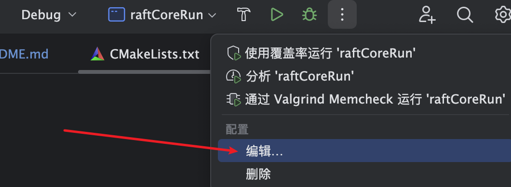
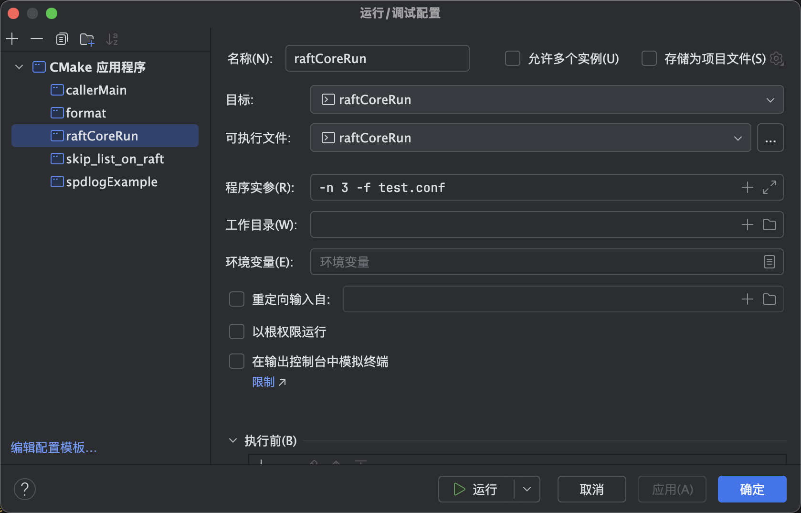
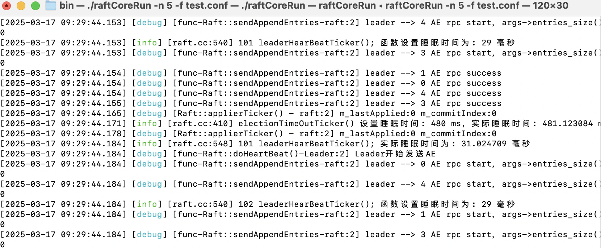
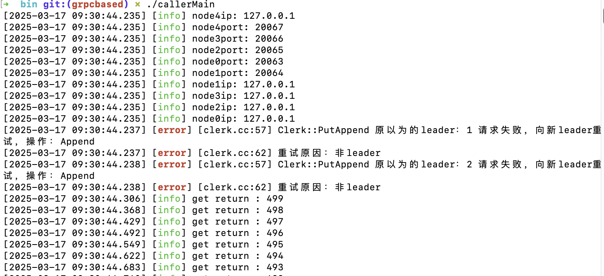
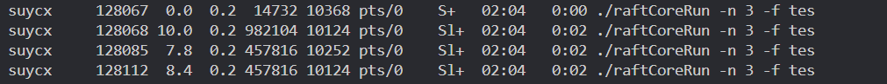
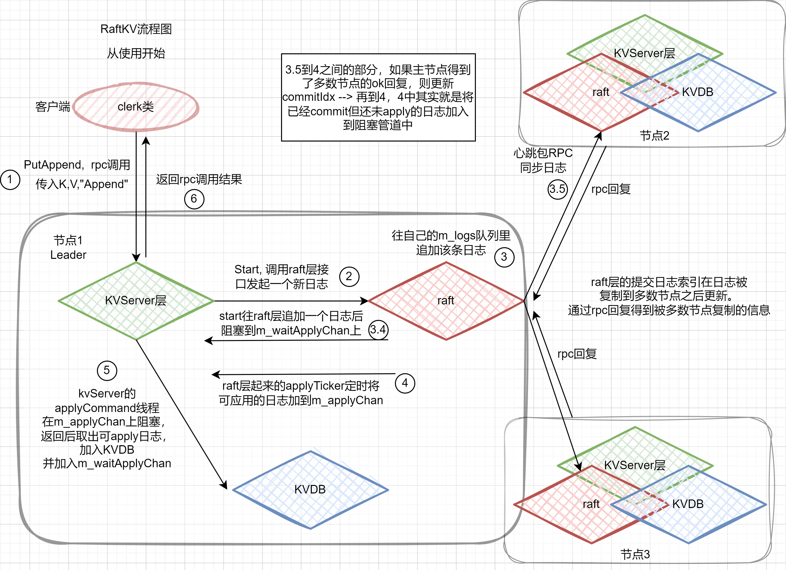

# KVstorageBaseRaft-cpp - 基于gRPC和Boost.asio的分布式KV存储系统（grpcbased分支）

[集成rpc服务的sylar框架仓库及说明](https://github.com/SuycxZMZ/sylar-from-suycx)

## [原KVstorageBaseRaft-cpp项目简介](docs/README.md)

## [main分支](https://github.com/SuycxZMZ/KVstorageBaseRaft-cpp/tree/main)

## [sylarbased分支](https://github.com/SuycxZMZ/KVstorageBaseRaft-cpp/tree/sylarbased)

每个分支都有改进点，细节见分支主页readme

## 🚀 核心技术栈

- Linux, C/C++ (C++11)
- Boost.Asio
- gRPC, Protobuf
- 协程 (coroutine)
- Socket API
- 多线程, Hook

[sylar和muduo的一些总结](https://zakuv5r1g02.feishu.cn/wiki/NTbawzte0iyYnrkYfyMc8PmwnlP?from=from_copylink)，批判性的看就行，这是我秋招刚开始时写的，后面没有再改

## 🔧 gRPC重构版核心改进

本分支对原Raft实现进行重构，引入现代C++最佳实践与高效的第三方库，重点优化了网络通信、日志记录、并发控制及代码结构。

- raft核心代码注释补全，[主干详细代码执行流说明](docs/项目解析.md)
- [main分支](https://github.com/SuycxZMZ/KVstorageBaseRaft-cpp/tree/main)重写muduo网络库，主要组件均已实现，支持更简单好用的异步日志系统。[日志系统可以单独剥离](https://github.com/SuycxZMZ/symlog)。
- [sylarbased分支](https://github.com/SuycxZMZ/KVstorageBaseRaft-cpp/tree/sylarbased)基于sylar网络库的实现，比main分支更优雅，细节可以跳转过去看
- [rpc详细解析](https://github.com/SuycxZMZ/MpRPC-Cpp)，这个我画的是muduo作为底层的结构，其实sylar也差不多，最主要的是重写handleClient，在muduo中是onMessage
- AE和投票信息的的发送使用`boost`线程池处理，避免频繁创建销毁大量线程。
- `electionTimeOutTicker`和`leaderHearBeatTicker`两个定时任务使用`boost::asio`协程执行，节省线程切换的开销
- 优化代码组织结构，移除多余的include文件夹，更清爽的cmake代码结构，减少重复编译和路径污染
- 引入开源库[spdlog](https://github.com/gabime/spdlog)代替原本的简陋打印函数，支持异步日志，更优雅
- 引入开源库[cpp-channel](https://github.com/andreiavrammsd/cpp-channel)代替原本的手搓阻塞队列，golang风格，更优雅(只在原版代码中添加了超时弹出的接口)
- 引入开源库[Defer-C++](https://github.com/Neargye/scope_guard)代替原本手搓的DEFER，该库主要使用RAII手法封了一套宏，使用简单，写的也比较规范
- gRPC使用Http2.0作为网络传输协议，支持流式处理，多个流可以复用同一条连接
- stub是线程安全的，对于raft层来说，多个线程可以安全调用同一个stub
- 支持超时和重试，代码更加高效和简洁，支持负载均衡和服务发现，配置起来更加优雅
- 由于 GitHub 在部分地区的验证限制，最新代码也已同步至 [Gitee仓库](https://gitee.com/suycx/KVstorageBaseRaft-cpp)。

## 🛠️ 使用指南

### 📦 环境说明

本项目已在以下环境测试通过，建议使用相似版本以确保编译与运行顺利：

- 我的开发环境是ubuntu24.04WSL，如果是20或者22，建议手动编译安装最新的boost库。g++或者clang++要支持C++20标准。
- 新修改的版本支持MacOS，我的测试机芯片是m1/m4，MacOS15.1(15.5)，用了boost1.86.0(**仅grpc分支**，sylar和muduo分支不支持)

列一下我的环境：

```shell
ubuntu24.04 WSL
gcc version 13.2.0(Mac下为 clang++16.0)
boost version 1.83.0
GNU Make 4.3
cmake version 3.28.3
protobuf 3.13
grpc 1.34
```

### 📚 依赖库准备

- 安装[grpc](https://www.llfc.club/category?catid=225RaiVNI8pFDD5L4m807g7ZwmF#!aid/2TIG572uTKxQxned7LCk8KoulfL)，从官网安装时，子模块非常难下载，这个版本是grpc1.34版，配套的是protobuf3.13
- `boost`：`sudo apt-get install libboost-dev libboost-test-dev libboost-all-dev`
- boost也可以使用[源码包](https://www.boost.org/)编译安装，命令百度或者ChatGPT都行，linux和Mac下暂时没什么坑。

### 🏗️ 编译与构建

#### 💻 命令行编译方式

```shell
## Debug版
bash build.sh DEBUG

## Release版
bash build.sh RELEASE
```

之后在目录bin就有对应的可执行文件生成：

- `callerMain`(consumer)
- `raftCoreRun`(provider)
  
注意先运行provider，再运行consumer
运行时在bin目录下`./raftCoreRun -n 5 -f test.conf`，再开一个终端`./callerMain`，启动raft集群和测试客户端代码

#### 📝 CLion 配置参考





#### 🚀 Provider 节点运行效果



#### 📞 Caller 客户端运行效果



## 🧪 节点故障模拟实验

### 🔍 查看节点进程号

```shell
# raftCoreRun 跑起来之后可以查看几个节点的子进程
ps -aux ｜ grep raft
# mac下参数可能要换一下
ps -a | grep raft
```

#### linux 下大致长这样



#### mac下大致长这样


### ❌ 模拟节点故障（Kill 或 暂停）

```shell
# 1. 
# ps打印出来有进程号，一般第一个进程是父进程，在后面几个中随机抽一个，杀掉
kill -9 <pid>
# 在运行 raftCoreRun 的终端还可以看到剩下的节点在继续运行，运行caller还可以正常工作，集群正常

# 2. 
# 也可以通过暂停进程来查看，
# 不过这个caller端的现象现在没改，caller会连接所有节点，暂停的话会有一个阻塞，卡住动不了，但是选举过程还是可以观察的
# 暂停进程
kill -19 <pid>
# 恢复进程
kill -18 <pid>
```

## 🖼️ 客户端请求流程示意图



## 📚 相关文档

- [项目解析](docs/项目解析.md)
- [tinymuduo](https://github.com/SuycxZMZ/tiny-muduo)
- [基于tinymuduo的RPC框架](https://github.com/SuycxZMZ/MpRPC-Cpp)
- [sylar协程框架](https://github.com/SuycxZMZ/sylar-from-suycx)
- [恋恋风尘的boostAsio和grpc讲解](https://llfc.club/category?catid=225RaiVNI8pFDD5L4m807g7ZwmF#!aid/2LfzYBkRCfdEDrtE6hWz8VrCLoS)

## 📝 TODO

**待改善**：

- [x] `electionTimeOutTicker`和`leaderHearBeatTicker`任务使用boost协程实现
- [x] 使用`spdlog`格式化日志打印，增强扩展性和可读性，可以很方便的做异步输出和文件输出
- [x] 项目之后基本不再会更新，三个分支作为应届生秋招项目已经足够
  
## 🙏 参考资料与致谢

- [陈硕muduo](https://github.com/chenshuo/muduo)
- [原项目仓库](https://github.com/youngyangyang04/KVstorageBaseRaft-cpp)
- [CSDN-Yugang_Yang对muduo库的一些解析](https://blog.csdn.net/T_Solotov/article/details/124044175)
- [知乎-无始对muduo库的一些解析](https://zhuanlan.zhihu.com/p/636581210)
- [最初始的简化muduo复现](https://github.com/Shangyizhou/A-Tiny-Network-Library)
- [博客园Leaos对muduo日志的解析](https://www.cnblogs.com/tuilk/p/16793625.html)
- [cpp-channel库](https://github.com/andreiavrammsd/cpp-channel)
- [scope_guard库](https://github.com/Neargye/scope_guard)
- [恋恋风尘博客](https://llfc.club/)
- [GRPC](https://grpc.io/)
- [Boost](https://www.boost.org)
